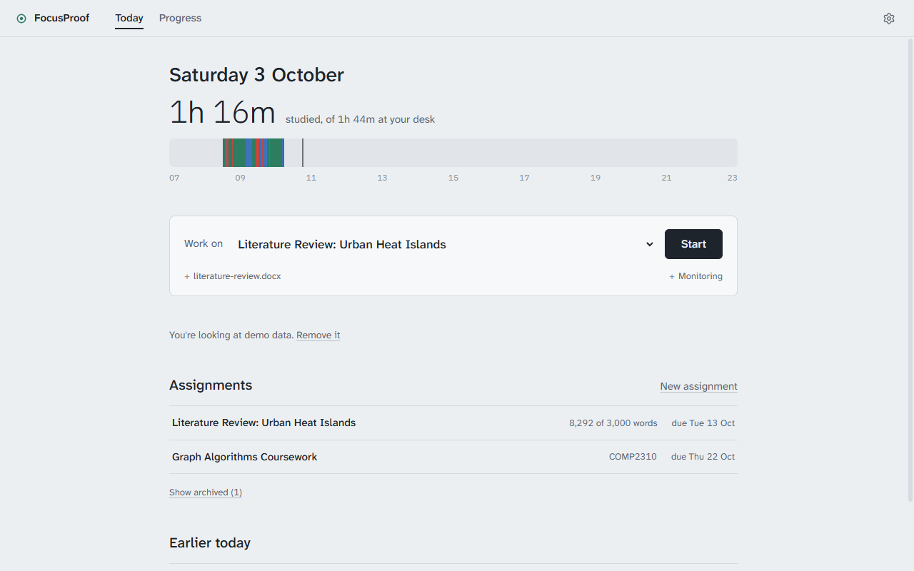
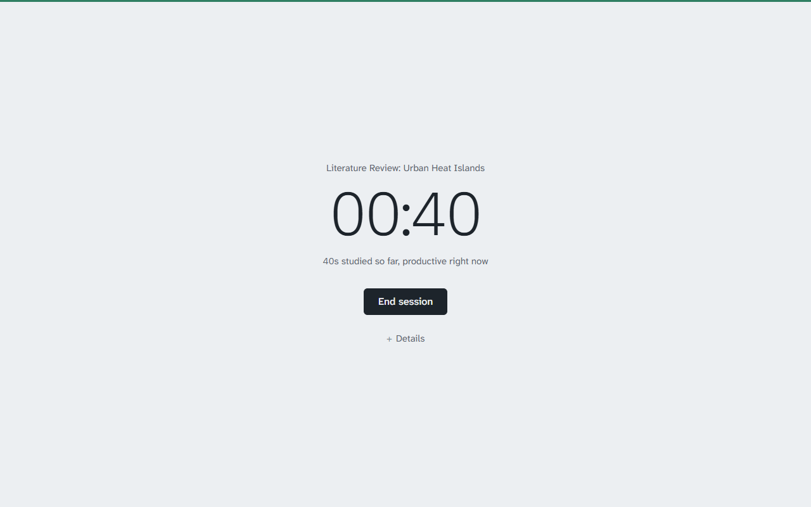
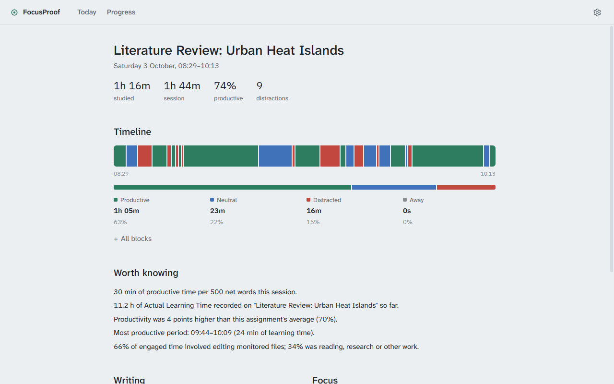
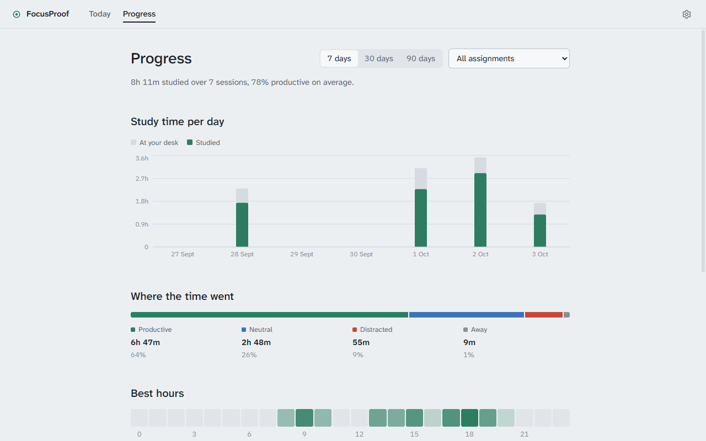
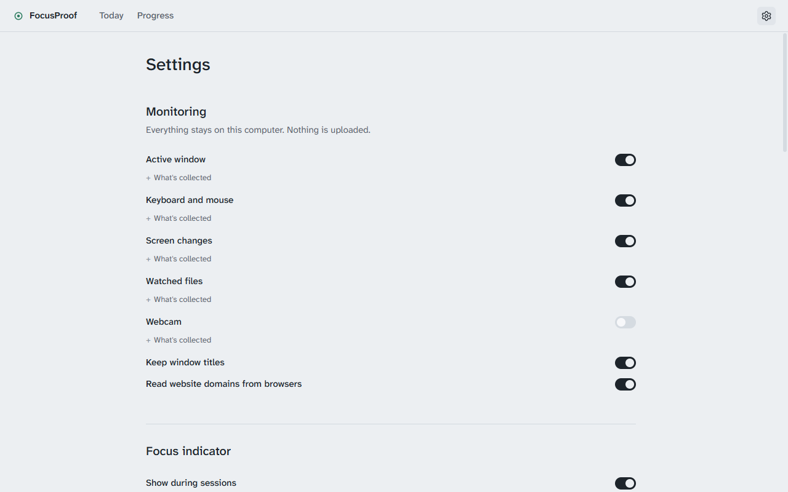
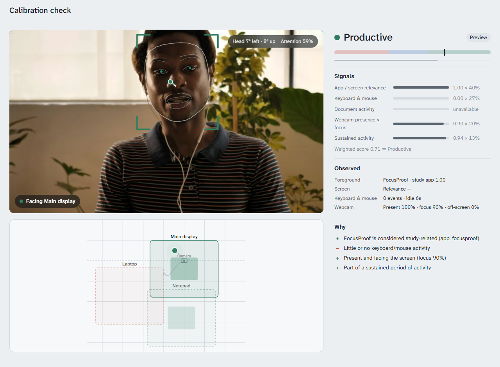

# FocusProof

FocusProof is a study timer that only counts the time you're actually working. It tracks your sessions and shows how much was **Actual Learning Time (ALT)**: time spent working, not time spent on YouTube or away from your desk.

Everything runs and stays on your computer.

<picture>
  <source media="(prefers-color-scheme: dark)" srcset="docs/screenshots/today-dark.png">
  
</picture>

## Starting the app

You need **Windows 10/11**.

### Installer

Download **FocusProof Setup** from the [latest release](https://github.com/nnilf/FocusProof/releases/latest) and run it. The installer isn't code-signed, so Windows may warn you: choose **More info → Run anyway**.

### From the source

You also need **[Node.js](https://nodejs.org) 22 or newer**.

1. Open the `FocusProof` folder.
2. Double-click **`FocusProof.cmd`**.

The first start takes a few minutes while it installs. After that, it opens straight away.

To get a desktop icon and find FocusProof in Windows Search, run this once in a terminal in the folder:

```
npm run shortcut
```

## Using it

1. On **Today**, choose **New assignment** and add what you're working on, with the files to watch (e.g. your essay `.docx`).
2. Pick it in the start bar and press **Start**. The window switches to a simple timer. Work as normal.
3. Press **End session** to see your report: ALT, a timeline of your session, and words written.
4. **Today** shows the day as a strip, with each session at the time it happened. **Progress** shows your study time over the last 7, 30 or 90 days, and every session.

<table>
  <tr>
    <td width="50%"><picture>
  <source media="(prefers-color-scheme: dark)" srcset="docs/screenshots/session-dark.png">
  
</picture><br>While you work, the window is just a timer.</td>
    <td width="50%"><picture>
  <source media="(prefers-color-scheme: dark)" srcset="docs/screenshots/report-dark.png">
  
</picture><br>Each report shows when you were focused, and why.</td>
  </tr>
  <tr>
    <td width="50%"><picture>
  <source media="(prefers-color-scheme: dark)" srcset="docs/screenshots/progress-dark.png">
  
</picture><br>Progress over the last 7, 30 or 90 days.</td>
    <td width="50%"><picture>
  <source media="(prefers-color-scheme: dark)" srcset="docs/screenshots/settings-dark.png">
  
</picture><br>Every source can be switched off, with what it collects.</td>
  </tr>
</table>

Click any block on a report's timeline to see why it was classified that way.

During a session, a small dot in the corner of your screen shows your current state: **green** for productive, **blue** for neutral, a **red ring** for distracted, and **grey** for away. Change the corner, display, size and any extra details in **Settings → Focus indicator**.

**Two monitors with the webcam on?** Go to **Settings** (the gear, top right) **→ Webcam** and look at each screen when asked. Looking at either screen then counts as focused.

To see what the webcam picks up, press **Check** in the same place. A window opens with your camera, where it thinks you're facing, and every signal behind the current status. Nothing in it is saved.

<picture>
  <source media="(prefers-color-scheme: dark)" srcset="docs/screenshots/check-dark.png">
  
</picture>

**Write on a paper notepad?** Add it under **Work areas** so looking at it counts as focused.

**A laptop, TV or phone nearby?** Add it under **Distraction areas** in the same place. Looking at it then counts as distracted. You can also choose how looking away from all screens is counted (Ignore, Neutral or Distracted).

## What is ALT?

Every few seconds, FocusProof labels what you're doing:

| Label | Meaning | Counts towards ALT |
| --- | --- | --- |
| Productive | Working in a study app, typing, editing your files, or reading study material | Fully |
| Neutral | Unclear, e.g. your assignment open with no edits, or a long pause while reading | Half |
| Distracted | Distracting sites or apps, or inactive on non-study apps | No |
| Away | Not at the computer | No |

Reading counts as productive while you scroll or turn pages at least every 3 minutes (5 with the webcam on and seeing you face the screen). Change the time under **Settings → Advanced → Reading pause**.

AI chat assistants such as Claude and ChatGPT count as study sites, since they're often used for research and testing ideas. Remove them under **Settings → Websites** if you'd rather they didn't.

ALT is an estimate based on your activity. It can't measure how much you learned.

## Privacy

- **Nothing leaves your computer.** There are no accounts, no uploads and no tracking.
- **Webcam:** off by default. When it's on, only "present" and a focus score are saved. No video or images.
- **Screen:** only a small thumbnail is checked for changes in memory. Screenshots are never saved.
- **Keyboard and mouse:** only *how much* you use them. Keys are never recorded.
- **Files:** only word and line counts are saved, never the contents.
- **Websites:** only the domain (e.g. `netflix.com`) is read from the browser's address bar, never the full address.

Each source can be switched off under **Settings → Monitoring**, where you can also see exactly what it collects.

## Troubleshooting

- **Webcam option greyed out:** run `npm run fetch-models` in the folder, then restart.
- **App won't start after an update:** run `node scripts/launch.mjs --rebuild`.
- **A session was interrupted** (crash or power cut): on the next start you can resume it, save it, or discard it.

## For developers

```
npm run dev        # run with hot reload
npm test           # unit tests
npm run lint       # lint
npm run typecheck  # type checks
npm run dist       # build a Windows installer into release/
npm run screenshots  # regenerate the README screenshots from demo data
```

The code is split into three parts:

- `src/main`: all the logic, including monitoring, the scoring engine (`engine/`) and the database.
- `src/renderer`: the React UI.
- `src/shared`: types shared by both.

The scoring engine is pure and swappable: implement `LearningTimeEngine` and register it with `registerEngine()`.

## Licence

MIT. See [LICENSE](LICENSE).
